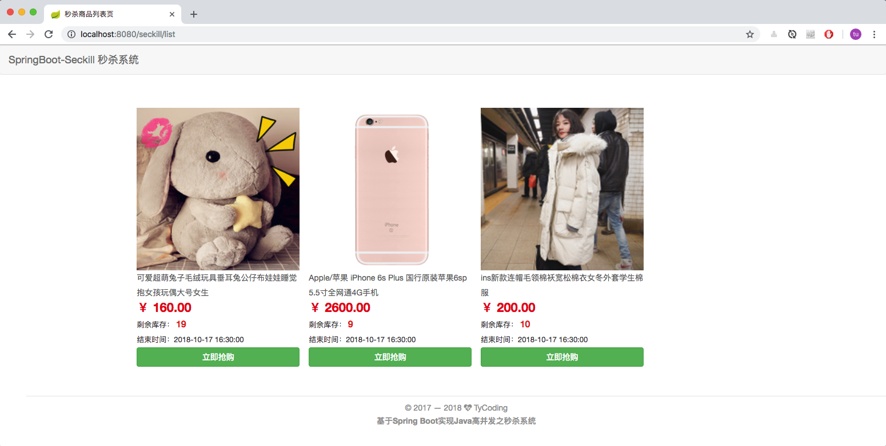
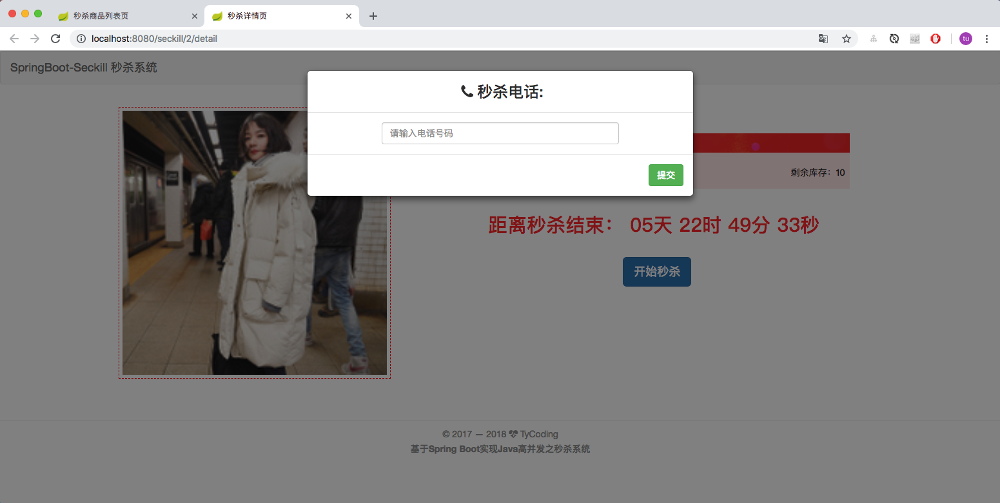
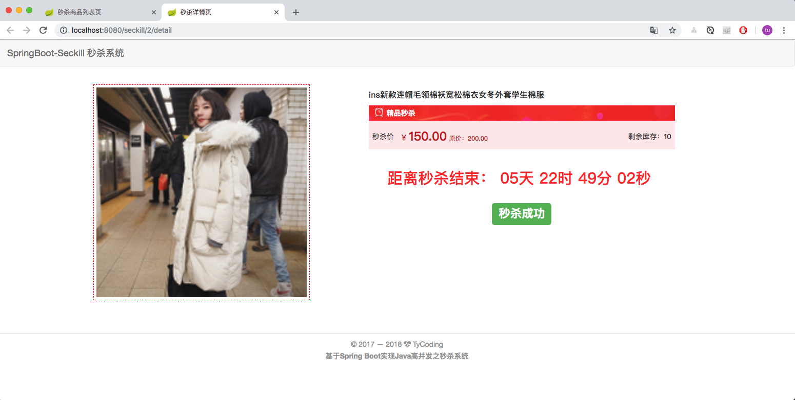

**基于SpringBoot实现Java高并发之秒杀系统**

**技术栈**

* 后端： SpringBoot-2.x + Redis-4.x

* 前端： Bootstrap + Jquery

**测试环境**

* IDEA + Maven-10.13 + Tomcat8 + JDK8

**启动说明**

* 启动前，请配置好 [application.yml](https://github.com/TyCoding/springboot-seckill/blob/master/src/main/resources/application.yml) 中连接数据库的用户名和密码，以及Redis服务器的地址和端口信息。

* 启动前，请创建数据库`seckill`，建表SQL语句放在：[/db/sys_schema.sql](https://github.com/TyCoding/springboot-seckill/blob/master/db/sys_schema.sql)。具体的建表和建库语句请仔细看SQL文件。

* 配置完成后，运行位于 `src/main/cn/tycoding/`下的SpringbootSeckillApplication中的main方法，访问 `http://localhost:8080/seckill/` 进行API测试。

* 注意[/db/sys_data.sql](https://github.com/TyCoding/springboot-seckill/blob/master/db/sys_data.sql)中秒杀商品的日期可能要修改，自行修改为符合商品秒杀条件的时间即可。

**写在前面**

SpringBoot不是对Spring功能上的增强，而是提供了一种快速使用Spring的方式，所以本质上和SSM框架差别不大，所以学习此项目不仅可以学习到秒杀系统的设计流程还能很好的练习一下SpringBoot框架。当然如果你对SpringBoot框架不是很熟悉的话，我推荐你你看一下：

* [SpringBoot入门之工程搭建（IDEA版）](http://tycoding.cn/2018/09/28/boot/spring-boot/)
* [SpringBoot整合mybatis实现CRUD业务](http://tycoding.cn/2018/09/30/boot/springboot-mybatis/)

欢迎star(#^.^#)


**项目设计**

```
.
├── README  -- Doc文档
├── db  -- 数据库约束文件
├── mvnw  
├── mvnw.cmd
├── pom.xml  -- 项目依赖
└── src
    ├── main
    │   ├── java
    │   │   └── cn
    │   │       └── tycoding
    │   │           ├── SpringbootSeckillApplication.java  -- SpringBoot启动器
    │   │           ├── controller  -- MVC的web层
    │   │           ├── dto  -- 统一封装的一些结果属性，和entity类似
    │   │           ├── entity  -- 实体类
    │   │           ├── enums  -- 手动定义的字典枚举参数
    │   │           ├── exception  -- 统一的异常结果
    │   │           ├── mapper  -- Mybatis-Mapper层映射接口，或称为DAO层
    │   │           ├── redis  -- redis,jedis 相关配置
    │   │           └── service  -- 业务层
    │   └── resources
    │       ├── application.yml  -- SpringBoot核心配置
    │       ├── mapper  -- Mybatis-Mapper层XML映射文件
    │       ├── static  -- 存放页面静态资源，可通过浏览器直接访问
    │       │   ├── css
    │       │   ├── js
    │       │   └── lib
    │       └── templates  -- 存放Thymeleaf模板引擎所需的HTML，不能在浏览器直接访问
    │           ├── page
    │           └── public  -- HTML页面公共组件（头部、尾部）
    └── test  -- 测试文件
```


## Doc

本项目一共分为四个模块来讲解，具体的开发教程请看我的博客文章：

* [SpringBoot实现Java高并发秒杀系统之DAO层开发（一）](http://tycoding.cn/2018/10/12/ssm/seckill-dao/)

* [SpringBoot实现Java高并发秒杀系统之Service层开发（二）](http://tycoding.cn/2018/10/13/ssm/seckill-service/)

* [SpringBoot实现Java高并发秒杀系统之Web层开发（三）](http://tycoding.cn/2018/10/14/ssm/seckill-web/)

* [SpringBoot实现Java高并发秒杀系统之并发优化（四）](http://tycoding.cn/2018/10/15/ssm/seckill/)


<br/>

# Preview







<br/>

# 交流

如果大家有兴趣，欢迎大家加入我的Java交流群：671017003 ，一起交流学习Java技术。博主目前一直在自学JAVA中，技术有限，如果可以，会尽力给大家提供一些帮助，或是一些学习方法，当然群里的大佬都会积极给新手答疑的。所以，别犹豫，快来加入我们吧！

<br/>

# 联系

If you have some questions after you see this article, you can contact me or you can find some info by clicking these links.

- [Blog@TyCoding's blog](http://www.tycoding.cn)
- [GitHub@TyCoding](https://github.com/TyCoding)
- [ZhiHu@TyCoding](https://www.zhihu.com/people/tomo-83-82/activities)
